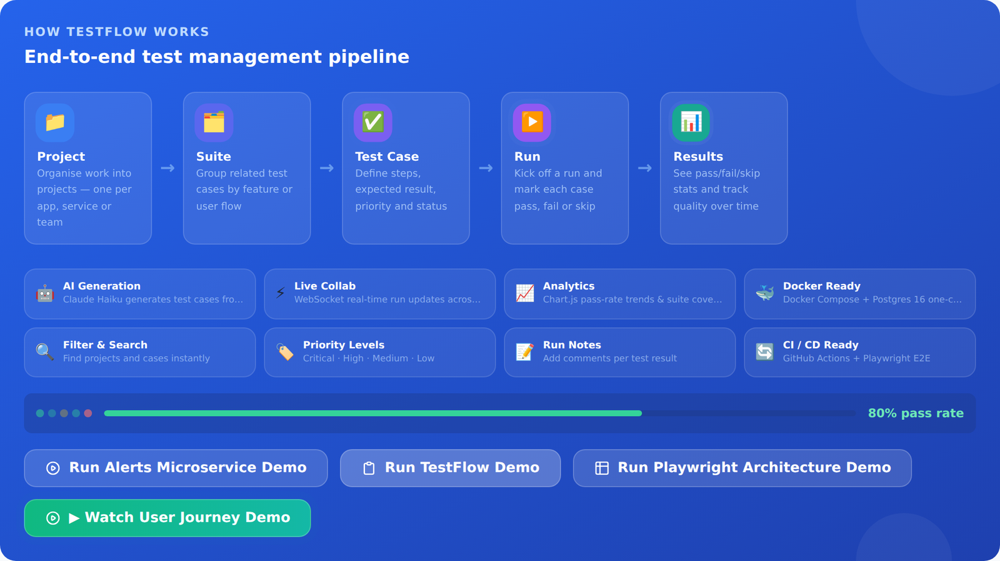
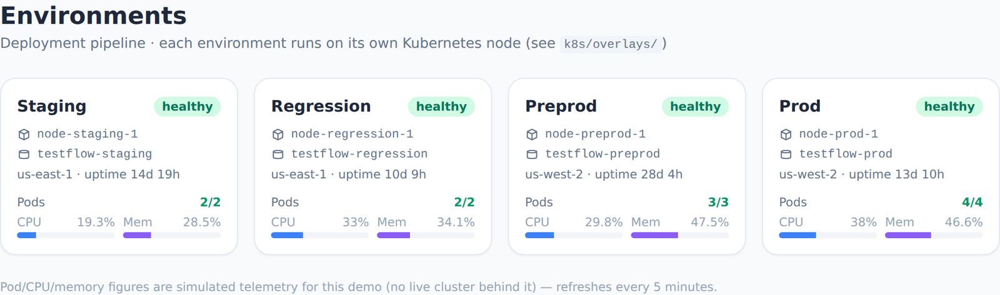
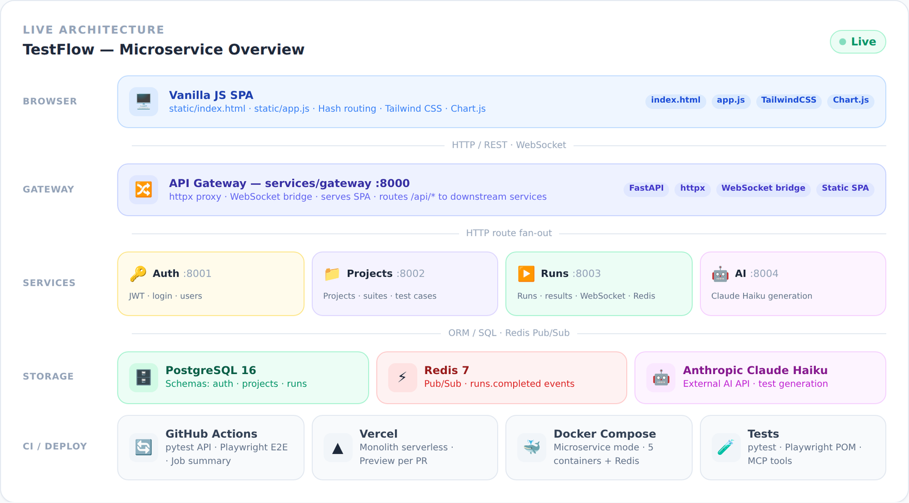
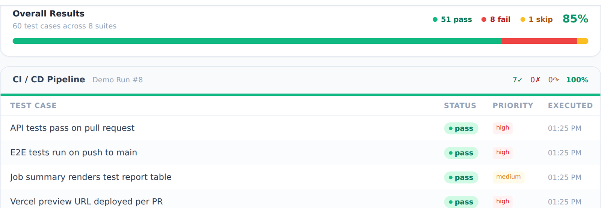
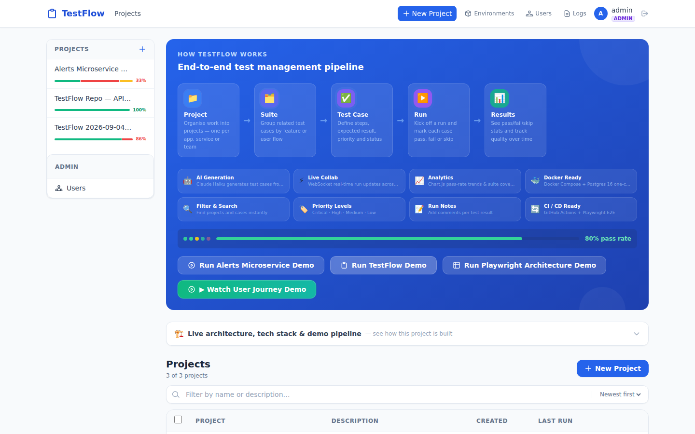
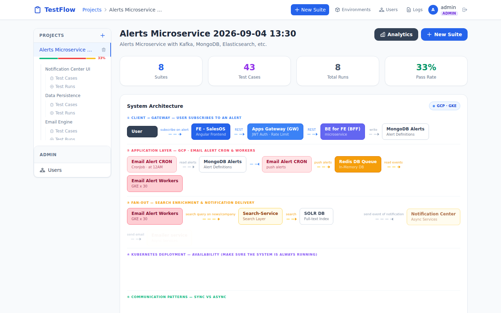
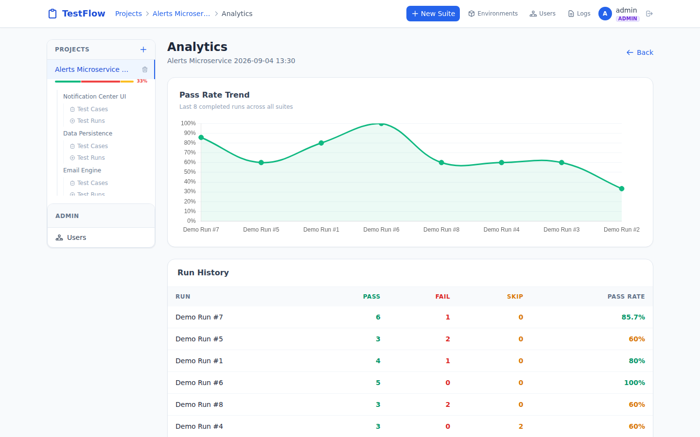
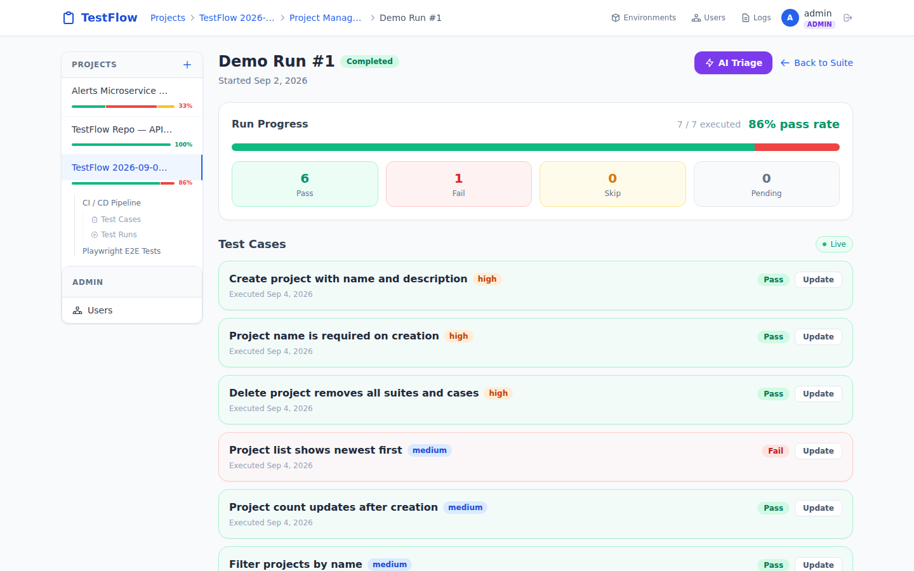

# TestFlow — Test Case Management

**Live demo:** [test-case-management-rabinavidans-projects.vercel.app](https://test-case-management-rabinavidans-projects.vercel.app/) · **Repo:** [rabinavidan/test-case-management](https://github.com/rabinavidan/test-case-management)

A full-stack test case management platform built with FastAPI microservices, Vanilla JS, PostgreSQL, and Redis.
Designed to demonstrate cutting-edge engineering practices — microservice decomposition, event-driven async,
real-time WebSocket collaboration, and AI-powered test generation, failure triage, and flaky-test detection
(via Anthropic's Claude Haiku). Backed by **five independent, feature-equivalent test automation stacks** —
Python/pytest, TypeScript/Playwright, Java/REST Assured, Java/Playwright, and Cucumber/Gherkin BDD — see
[Test Architecture](#test-architecture) below.

> **Note for reviewers:** two of the five test suites are written in Java — [`java-tests/`](java-tests/README.md)
> (JUnit 5 + REST Assured, black-box API tests) and [`java-e2e/`](java-e2e/README.md) (JUnit 5 + Playwright Java,
> browser E2E). Both run standalone with Maven (`mvn test`) and are feature-equivalent to the Python and
> TypeScript suites. A fifth, [`e2e-bdd/`](e2e-bdd/README.md) (Cucumber.js + Playwright), covers the same core
> flows as Gherkin feature files, with a companion Azure DevOps pipeline ([`azure-pipelines.yml`](azure-pipelines.yml))
> alongside the GitHub Actions workflows — see [Test Architecture](#test-architecture).

---

## AI Engineering — Not Just AI Features

Beyond LLM-powered product features, this repo is a working example of **agentic AI running in production
CI/CD** — three independent AI agents, deliberately split across two model providers by cost/capability
trade-off, each with its own failure-handling and test coverage — plus a fourth, authoring-time agent set that
writes and self-heals the test suite itself:

| Agent | What it does | Model | Where |
|-------|-------------|-------|-------|
| **PR Steward** | Runs autonomously on every PR event (open, review, `@claude` comment) — diagnoses CI failures, pushes fixes, resolves review threads, following repo-specific conventions defined in its own skill file | Claude (Anthropic) | [`.github/workflows/claude-pr-steward.yml`](.github/workflows/claude-pr-steward.yml) · [`.claude/skills/steward/SKILL.md`](.claude/skills/steward/SKILL.md) |
| **Coverage-Gap Agent** | Diffs a PR's changed source files against its test files; for any gap, prompts an LLM for concrete, specific test-case suggestions and posts them as a PR comment | Gemini (free tier) | [`scripts/coverage_gap_agent.py`](scripts/coverage_gap_agent.py) |
| **Flaky-Test Detector** | Parses CI rerun results to distinguish "needed a retry" from a real failure, and maintains a single tracking GitHub issue across runs | Deterministic (no LLM) | [`scripts/flake_report.py`](scripts/flake_report.py) |
| **Playwright Test Agents** | Planner/generator/healer trio: explores the running app in a real browser, drafts a numbered test plan, generates Playwright specs from it, and debugs/fixes failing ones — an authoring aid, not a CI job. The healer classifies each failure as safe-to-auto-fix (locator/timing drift) or a suspected real defect (behavior change) — the latter is *never* silently skipped, only escalated — and every healing session is logged to `heal-outcomes/heal_outcomes.jsonl`, scored by [`scripts/heal_metrics.py`](scripts/heal_metrics.py) (heal-success-rate, false-heal-rate) | Claude (Sonnet, via Claude Code) | [`.claude/agents/playwright-test-*.md`](.claude/agents) · [`e2e/README.md#playwright-agents`](e2e/README.md#playwright-agents) |
| **AI Test Generation** | Generates test cases from a plain-English feature description; can optionally run "grounded" (`grounded: true`), retrieving the suite's nearest existing test cases by embedding similarity and passing them as "don't duplicate these" context (monolith only — see `api/retrieval.py`) | Claude Haiku | `POST /api/suites/{id}/testcases/generate` |
| **AI Failure Triage** | Summarizes a run's failed/skipped results into a root-cause hypothesis | Claude Haiku | `POST /api/runs/{id}/triage` |
| **Eval Harness** | Runs the AI Test Generation and AI Failure Triage prompts N times per case against a local model, scoring output quality *and* run-to-run consistency; wired into CI (informational) against a real model | Ollama (local, no API key) | [`evals/`](evals/README.md) · [`.github/workflows/eval-harness.yml`](.github/workflows/eval-harness.yml) |
| **Test Plan Reviewer** | A genuine two-step agent pipeline built with **LangChain** (`prompt \| llm \| parser`, LCEL) — a critic step finds test-coverage gaps for a feature, a drafter step writes test cases to fill them, in the same schema AI Test Generation uses | Ollama (local, no API key) | [`agents/`](agents/README.md) |

**Why this matters more than "calls an LLM API":**
- **Model choice is a deliberate trade-off, not a default** — Claude Haiku for in-product, low-latency, user-facing
  calls; Gemini's free tier for a CI-only agent where cost dominates and the task is plain text generation, not
  agentic tool use; Claude Sonnet where a real browser and multi-step tool use are the job. That reasoning is
  documented in code, not just picked once and forgotten.
- **Every AI integration degrades gracefully** — no API key configured means the feature (or agent) skips
  cleanly instead of crashing the app or failing CI for unrelated reasons.
- **Agents are tested like code, not treated as magic** — LLM calls are mocked in the test suite; prompts,
  response parsing, and the surrounding control flow all have dedicated unit tests.
- **Non-determinism is measured, not assumed away** — the eval harness runs the same prompt multiple times per
  case and reports both average quality and run-to-run variance, because a single passing response proves
  nothing about a model that can answer the same prompt differently next time.
- **A real agent framework where one earns its keep, not everywhere** — every other agent here is a single-shot
  LLM call, hand-rolled against a plain HTTP client because that's all a single call needs. The Test Plan
  Reviewer is a genuine multi-step pipeline (its second step's prompt depends on the first step's output), which
  is exactly the shape LangChain's composable chains are for — used deliberately there, not bolted on for the
  sake of a framework line.
- **The Steward agent is a real software engineering agent** — it doesn't just chat, it reads CI logs, writes
  and pushes commits, and resolves GitHub review threads inside guardrails defined in its own skill file.
- **Authoring-time agents are scoped separately from CI-time ones** — the Playwright Test Agents run
  interactively inside a developer's Claude Code session (via a dedicated `playwright-test` MCP server, root
  [`.mcp.json`](.mcp.json)), never unattended in a workflow; everything they produce is an ordinary `*.spec.ts`
  file that still goes through human review and the existing `pw-ts.yml` pipeline like any other change.

See [`docs/interview-prep/agentic-ai-test-engineering.md`](docs/interview-prep/agentic-ai-test-engineering.md)
for the deeper case study behind the Eval Harness and Test Plan Reviewer — what they're for, the real failures
and dependency conflicts hit building them, and the honest gaps not to oversell.

---

<p align="center">
  
  
</p>
<p align="center">
  
  
</p>

**App in action:**

<p align="center">
  
  
</p>
<p align="center">
  
  
</p>

---

## Portfolio & Recruiter Experience

The public, unauthenticated view (visiting the app with no session) is built for a recruiter or hiring
manager evaluating this repo, not only as a test-management product demo. Everything below is generated
directly from this repository's own code, tests, and CI — not a static marketing page.

- **Automation Tech Lead positioning** — the hero identifies the owner's role and links directly to the live
  demo, the architecture panel, GitHub, and LinkedIn, all reachable in one action with no sign-in required.
- **Leadership Impact** — five cards, each backed by something this repo actually enforces (CI quality
  gates, the five-stack test pyramid, the microservice decomposition, the AI PR Steward) rather than a
  generic "led a team of X" claim this solo-maintained project can't back up.
- **Test Pyramid & Shift-Left** — real, measured test counts per layer (`pytest --collect-only`,
  `playwright test --list`, `@Test` counts), never invented numbers.
- **AI-First Quality Engineering** — six concrete AI-assisted workflows, each pointing at the real file or
  workflow behind it (see [AI Engineering](#ai-engineering--not-just-ai-features) above).
- **Quality Engineering KPIs** — a typed KPI dashboard with current value, target, status, and definition per
  metric; a KPI with no real data source honestly reads "Not yet measured" rather than a guess.
- **Architecture Decisions & Trade-offs** — service boundaries, event flow, deployment, and observability,
  sourced from [`services/README.md`](services/README.md) and [`k8s/README.md`](k8s/README.md), including a
  real concurrency trade-off found through load-testing rather than assumed.
- **Recruiter Tour** — an optional five-step, read-only guided walkthrough of all of the above, under three
  minutes, no sign-in, and creates nothing. Skippable/exitable at any point, and keyboard-operable — Tab
  cycles within the dialog, Escape closes it and returns focus to where the tour was started.

Demo buttons never create data for an unauthenticated visitor: they navigate to the existing flagship demo
project (or a curated welcome state if none exists yet) instead of seeding a new record on every visit.

> Screenshots of this guest-facing view aren't included yet. The gallery above predates this redesign and
> still reflects the signed-in product views; capturing accurate new screenshots needs a real browser session
> with the Tailwind CDN reachable, which this repo's own dev/CI environments have.

---

## Features

### Core workflow
- **Projects → Suites → Test Cases → Runs → Results** — complete test lifecycle management
- Paginated project listing with search (`?page=&page_size=&search=`)
- Priority levels (Critical / High / Medium / Low) and status labels (Active / Draft)
- Per-result run notes and pass / fail / skip marking

### Cutting-edge additions

| Feature | Tech | Endpoint / File |
|---------|------|----------------|
| **AI Test Generation** | Anthropic Claude Haiku (`claude-haiku-4-5-20251001`) | `POST /api/suites/{id}/testcases/generate` |
| **AI Failure Triage** | Claude Haiku summarizes a run's failed/skipped results into a plain-English root-cause guess | `POST /api/runs/{id}/triage` |
| **Flaky Test Detection** | Flags test cases whose pass/fail results flip-flop across runs (no AI needed — deterministic pattern matching) | `GET /api/suites/{id}/flaky-tests` |
| **CSV Export** | One row per test case with its most recent run status across the suite; UTF-8 BOM for non-ASCII titles and a formula-injection guard for values opened in Excel/Sheets | `GET /api/suites/{id}/export/csv` |
| **Real-time Collaboration** | WebSocket + Redis Pub/Sub | `WS /ws/runs/{run_id}` |
| **Analytics Dashboard** | Chart.js 4 (pass-rate trend line, suite coverage bars) | `GET /api/projects/{id}/analytics` |
| **Microservice Architecture** | 5 services · Docker Compose · Redis events | `services/` + `docker-compose.microservices.yml` |
| **Structured Logging** | Middleware logging every HTTP request with status and latency_ms; microservice mode also threads a correlation `request_id` across every service | `api/main.py` · `services/common/request_id.py` |
| **Paginated API** | Envelope `{items, total, page, page_size, total_pages}` | `GET /api/projects` |
| **Environments** | Four-stage deployment pipeline (staging → regression → preprod → prod), each pinned to its own Kubernetes node — see [`k8s/`](k8s/) for the kustomize manifests and the in-app dashboard for live (simulated) node/pod health. Runs can be tagged with the environment they executed against. *(monolith only)* | `GET /api/environments` · `k8s/overlays/*` |
| **Contact Us** | Public form (footer, no login required) — topic/email/phone/message, saved to the DB and emailed to the site owner via Resend or SMTP (configurable, see `.env.example`) | `POST /api/contact` |
| **Log Center** | Admin-only dashboard over every request/response, unhandled server exception, and reported browser-side error — filter by level/source, free-text search. A global `window.onerror`/`unhandledrejection` hook reports client errors automatically. Self-pruned at 5,000 rows. | `GET /api/logs` · `POST /api/logs/client` |

---

## Architecture

Two deployment modes are supported. The public URL surface (`/api/*`, `/ws/*`) is identical in both.

### Microservice mode *(recommended)*

```
Browser (Vanilla JS SPA)
  │  HTTP / REST + WebSocket
  ▼
┌─────────────────────────────────────────────────────────┐
│  Gateway  :8000  (httpx proxy · static file serving)    │
└──┬──────────┬──────────┬──────────────────────────┬─────┘
   │          │          │                          │
   ▼          ▼          ▼                          ▼
Auth:8001  Projects:8002  Runs:8003            AI:8004
JWT login  CRUD + stats  Runs + results        Claude Haiku
users      analytics     WebSocket             test generation
           demo seed     Redis pub/sub
               │              │
               └──────┬───────┘
                      ▼
               PostgreSQL 16 (one shared instance, table-prefixed per service)
               ├─ auth_users
               ├─ projects_projects, projects_test_suites, projects_test_cases
               └─ runs_test_runs, runs_test_results

               Redis 7
               └─ channel: runs.completed  (async event pub/sub)
```

**Key design decisions:**
- JWT embeds `role` claim — non-auth services verify tokens locally (no auth round-trip per request)
- Synchronous HTTP (httpx) for tight coupling: runs ↔ projects for test case lookup
- Redis Pub/Sub for fire-and-forget `run.completed` events; degrades gracefully if Redis is down
- Gateway is a thin proxy — frontend requires zero changes vs. the monolith

### Monolith mode *(original · still works)*

```
Browser (SPA)
  │  HTTP / REST + WebSocket
  ▼
FastAPI (api/main.py) — single process
  ├─ JWT auth middleware
  ├─ ConnectionManager (WebSocket broadcast)
  ├─ /api/suites/{id}/testcases/generate  ──► Anthropic Claude Haiku API
  └─ SQLAlchemy ORM
       ├─ PostgreSQL (Neon · production)
       └─ SQLite (/tmp · local dev / Vercel)
```

---

## Quick start

### Microservice mode (Docker Compose + Postgres + Redis)

```bash
cp .env.example .env   # set JWT_SECRET_KEY and ANTHROPIC_API_KEY
docker compose -f docker-compose.microservices.yml up --build
# open http://localhost:8000
```

### Monolith mode (local dev — SQLite)

```bash
pip install -r requirements.txt
uvicorn api.main:app --reload
# open http://localhost:8000
```

### Monolith mode (Docker Compose + Postgres)

```bash
cp .env.example .env
docker compose up --build
# open http://localhost:8000
```

### Environment variables

| Variable | Default | Description |
|----------|---------|-------------|
| `DATABASE_URL` | SQLite `/tmp/testflow.db` | Postgres URL for production |
| `JWT_SECRET_KEY` | `change-me-in-production` | HS256 signing secret |
| `ANTHROPIC_API_KEY` | *(empty)* | Required for AI test generation |
| `REDIS_URL` | `redis://localhost:6379` | Used by Runs service (microservice mode) |

---

## API reference (key endpoints)

All endpoints are identical regardless of deployment mode (monolith or microservices),
except `/api/environments`, which is monolith-only for now.

```
POST   /api/auth/register
POST   /api/auth/login
GET    /api/auth/me

GET    /api/environments                        # Staging/regression/preprod/prod health (monolith only)
POST   /api/contact                             # Contact Us form (public) — saves + emails the site owner

GET    /api/logs                                # Log Center (admin only) — filter by level/source, search
POST   /api/logs/client                         # Reports a browser-side error (public, no auth)

GET    /api/projects?page=1&page_size=50&search=
POST   /api/projects
DELETE /api/projects/{id}
GET    /api/projects/{id}/stats
GET    /api/projects/{id}/analytics

GET    /api/projects/{id}/suites
POST   /api/projects/{id}/suites

GET    /api/suites/{id}/testcases
POST   /api/suites/{id}/testcases
POST   /api/suites/{id}/testcases/generate      # AI generation (→ AI service)
POST   /api/suites/{id}/testcases/generate/save # Bulk save AI results

POST   /api/suites/{id}/runs                    # Body: {name, environment_key?} — tags the run with its environment
GET    /api/suites/{id}/runs
GET    /api/runs/{id}
PUT    /api/runs/{id}/results/{testcase_id}
POST   /api/runs/{id}/triage                    # AI failure triage — plain-English root-cause guess
GET    /api/suites/{id}/flaky-tests             # Flags test cases with repeated pass/fail flips

WS     /ws/runs/{run_id}                        # Real-time result updates
```

---

## Test Architecture

Five independent, feature-equivalent automation stacks drive the same app — same core flows, same public
`/api/*` surface — each targeting a different hiring context on purpose (see the breakdown below):

```
                              TestFlow (api/main.py + static/)
                                            ▲
              ┌──────────────┬─────────────┼─────────────┬──────────────┐
              │              │             │             │              │
      ┌───────▼──────┐┌──────▼───────┐┌────▼────────┐┌───▼──────────┐┌──▼───────────┐
      │  Python       ││  TypeScript  ││  Python     ││  Java        ││  Java        │
      │  pytest       ││  Playwright  ││  Playwright ││  REST Assured││  Playwright  │
      ├───────────────┤├──────────────┤├─────────────┤├──────────────┤├──────────────┤
      │ tests/unit    ││ e2e/tests/   ││ tests/e2e/  ││ java-tests/  ││ java-e2e/    │
      │ tests/api     ││  *.spec.ts   ││  *.py       ││  *.java      ││  *.java      │
      │ tests/contract││              ││             ││              ││              │
      │ tests/services││              ││             ││              ││              │
      ├───────────────┤├──────────────┤├─────────────┤├──────────────┤├──────────────┤
      │ in-process     ││ real browser ││ real browser││ black-box    ││ real browser │
      │ TestClient +   ││ + real HTTP  ││ + real HTTP ││ HTTP only —  ││ + real HTTP  │
      │ throwaway DB   ││              ││             ││ no shortcuts ││              │
      └───────┬───────┘└──────┬───────┘└──────┬──────┘└──────┬───────┘└──────┬───────┘
              │                │               │               │               │
              └────────────────┴───────────────┴───────────────┴───────────────┘
                                     Allure report (every run, every stack)
```

225 pytest tests, 40+ Playwright TS specs, 35 REST Assured tests, a JUnit 5/Playwright Java E2E suite, and a
Cucumber/Gherkin BDD suite — see the full breakdown below.

**Coverage:** ~89% line coverage of `api/`, `services/`, and `shared/` from the pytest suite alone (unit + API +
contract + services), measured with `pytest-cov` and enforced at an 85% floor in CI (`.github/workflows/test.yml`)
— a PR that drops coverage below that fails the build. This doesn't count the additional exercise from the
Playwright/REST Assured E2E suites, which run against a live deployment rather than in-process.

### Test types at a glance

| Type | What it checks | Where |
|------|-----------------|-------|
| **Unit** | Pure functions (JWT/hash logic) — no DB, no HTTP, no I/O | `tests/unit/` (pytest) |
| **API / integration** | Real FastAPI app + real (throwaway, per-test) SQLite DB, via `TestClient` | `tests/api/` (pytest) |
| **Contract** | Real responses validated against the app's own live OpenAPI schema — property-based edge cases, not just hand-picked examples | `tests/contract/` (pytest + Schemathesis) · `e2e/tests/contract.spec.ts` (Playwright + ajv + fast-check) |
| **Microservices** | Each of the 5 `services/` (auth, projects, runs, ai, gateway) tested in isolation — auth, CRUD, inter-service HTTP calls, graceful degradation when a downstream service or Redis is unreachable | `tests/services/` (pytest) |
| **Kafka producer/consumer** | `services/runs`' `alert.triggered` producer and `services/worker`'s consumer of it, unit-level with `KafkaProducer`/`KafkaConsumer` monkeypatched (no live broker needed) — publish success, broker-unreachable degradation, malformed-message and retries-exhausted routing to the dead-letter topic, transient-failure retry-then-succeed, idempotent persistence | `tests/services/test_kafka_producer.py`, `tests/services/test_kafka_consumer.py` (pytest) |
| **E2E / browser** | Full user flows through the real UI in a real browser, against a running instance of the app | `tests/e2e/` (pytest + Playwright) · `e2e/tests/*.spec.ts` (Playwright + TypeScript) · `java-e2e/` (JUnit 5 + Playwright Java) |
| **Java API** | Black-box HTTP tests against a running instance — no in-process shortcuts, same public `/api/*` surface as every other stack | `java-tests/` (JUnit 5 + REST Assured) |
| **BDD / Gherkin** | Stakeholder-readable Given/When/Then feature files over the same core flows (sign-in, project lifecycle), driven by Cucumber.js + Playwright | [`e2e-bdd/`](e2e-bdd/README.md) (Cucumber.js + Playwright + TypeScript) |
| **Regression** | Cross-layer tag (`-m regression`) for a scheduled full-suite run against a live deployment | `pytest.ini` marker, run by `pw-regression.yml` / `pw-scheduled.yml` |
| **Reporting** | Allure report (history, retries, step-by-step detail) generated from every run in CI | `allure-pytest` (Python) · `allure-playwright` (TypeScript) · `allure-junit5` (Java) |
| **Coverage** | Line coverage of `api/`, `services/`, `shared/` — ~89%, gated at an 85% floor | `pytest-cov` (`.coveragerc`), reported in the CI job summary and as a `coverage.json` artifact |
| **Scalability / load** | Throughput and latency under increasing concurrency against both live deployments — the same Locust scenarios against the SQLite monolith and the Postgres/Redis microservices stack, quantifying [issue #214](https://github.com/rabinavidan/test-case-management/issues/214)'s backend race on one and finding a new one ([#219](https://github.com/rabinavidan/test-case-management/issues/219)) on the other, not just pass/fail | [`loadtests/`](loadtests/README.md) (Locust), manual/monthly via `.github/workflows/loadtest-sqlite.yml` + `.github/workflows/loadtest-microservices.yml` |
| **Microservices boot smoke test** | Actually builds and boots `docker-compose.microservices.yml` (Postgres + Redis + all 5 services) and drives a real CRUD flow through the gateway — the one thing `tests/services/`'s in-process `TestClient` coverage can't catch. Found (and fixed) [issue #217](https://github.com/rabinavidan/test-case-management/issues/217): every service crash-looped on the documented `docker compose up --build`, undetected because nothing else in CI ever builds these images | `.github/workflows/microservices-smoke.yml`, every PR/push touching `services/`, `shared/`, or the compose file |

225 pytest tests total (7 unit + 126 API + 33 contract operations + 59 services), plus 40+ Playwright E2E specs,
35 JUnit 5/REST Assured API tests, a JUnit 5/Playwright-Java E2E suite, and a Cucumber/Gherkin BDD suite — five
independent automation stacks (Python, TypeScript, two in Java, and Cucumber) against the same app. See the
breakdown below for how each stack is built.

This project deliberately maintains **three independent, feature-equivalent browser-automation stacks** against the
same app — Playwright + TypeScript, Playwright + pytest (Python), and Playwright + Java (JUnit 5) — rather than
picking one. All three drive the same UI through a Page Object Model and cover the same core user flows (auth,
projects, suites, test cases, runs); the TypeScript and Python stacks run in CI on every PR, and stay in parity with
each other as new coverage is added (e.g. `login.spec.ts` / `test_login_e2e.py`, the sidebar pass-rate bar). A
fourth stack, JUnit 5 + REST Assured (`java-tests/`), covers the same API surface again as pure black-box HTTP
tests — see [below](#java--rest-assured-suite).

| | Playwright · TypeScript | Playwright · Python (pytest) | Playwright · Java (JUnit 5) |
|---|---|---|---|
| Location | [`e2e/`](e2e/README.md) | `tests/e2e/` | [`java-e2e/`](java-e2e/README.md) |
| Run with | `npm test` (`@playwright/test` runner) | `pytest tests/e2e -m regression` (`pytest-playwright`) | `mvn test` |
| Page Object Model | `e2e/pages/*.page.ts` | `tests/e2e/pages/*_page.py` | `java-e2e/.../pages/*.java` |
| Auth strategy | fixture-based token injection (`fixtures/auth.fixture.ts`) + a dedicated UI modal spec (`login.spec.ts`) | page-object login flow (`test_login_e2e.py`) | token injection (`BaseTest.signInAs`) + a dedicated UI modal spec (`LoginTest`) |
| Structured step logging | `logger.ts` (`log.step/action/assert`) | `logger.py` (`PWLogger`) | — |
| Failure diagnostics | screenshot + video + trace, only-on-failure (`playwright.config.ts`) | screenshot + video + trace, only-on-failure (`pytest.ini` `addopts`) | screenshot + video + trace, only-on-failure (`FailureArtifactsExtension`, [details](java-e2e/README.md#failure-diagnostics-screenshot--video--trace)) |
| CI workflow | `.github/workflows/pw-ts.yml` — every PR / push to `main` touching `e2e/`, `api/`, `static/` | `.github/workflows/test.yml`, `pw-scheduled.yml`, `pw-regression.yml` | `.github/workflows/java-e2e-tests.yml` — every PR / push to `main` touching `java-e2e/`, `api/`, `static/` |

The TypeScript and Python stacks get equal billing below — same depth of detail, same structure — since each
targets a different hiring context (Playwright/TypeScript roles vs. pytest/Python roles) and both are meant to
stand on their own. The Java stacks (both `java-e2e/` and `java-tests/`) target a third hiring context —
JUnit/Playwright/REST Assured roles — the same way; see their own READMEs for the same level of detail.

### Python · pytest suite

The Python side is further split into the classic pyramid — narrow and fast at the bottom, broad and slow at the
top — as five physically separate pytest layers under `tests/`.

```
tests/
├── conftest.py     # shared failure-logging hook + auto layer-marking (unit/api/contract/services/e2e)
├── unit/           # 7 tests   — pure functions, no DB/HTTP/I-O               (~1s total)
├── api/            # 126 tests — FastAPI TestClient against an in-memory DB   (~30s total)
│   └── conftest.py #   per-test SQLite engine + admin/executor auth fixtures
├── contract/       # 1 property-based suite (33 operations) — Schemathesis vs. the OpenAPI schema (~10s)
├── services/       # each services/ microservice in isolation, via TestClient   (~7s total)
│   ├── conftest.py #   per-service SQLite engine + JWT minting
│   ├── test_kafka_producer.py  # services/runs' alert.triggered producer, KafkaProducer monkeypatched
│   └── test_kafka_consumer.py  # services/worker's consumer of it — parsing, retry, dead-letter routing
└── e2e/            # 40+ tests — Playwright browser + deployed-instance API   (minutes; needs a running app)
    └── pages/      #   Page Object Model — locators isolated from test logic
```

**Engineering practices this demonstrates:**

- **Isolation over mocking-everything.** API tests hit the real FastAPI app and a real (but throwaway, per-test) SQLite database via `app.dependency_overrides` — so they verify actual SQLAlchemy behavior, not a stubbed-out fake, while staying hermetic and parallelizable.
- **Actually parallelized, not just "parallelizable."** `pytest-xdist -n auto` runs `tests/unit`/`api`/`contract`/`services` across worker processes — ~125s → ~35s locally on 4 cores — safe because every DB-backed fixture derives a worker-unique SQLite path from `PYTEST_XDIST_WORKER` (see `tests/api/conftest.py`), so parallel workers never race the same file. The TypeScript E2E suite (`e2e/`) shards across a CI matrix the same way, merging per-shard blob reports back into one report (`.github/workflows/pw-ts.yml`). The Java suites (`java-tests/`, `java-e2e/`) deliberately do **not** run parallel yet — enabling JUnit 5 concurrent test classes reproducibly exposed a real backend race (concurrent `DELETE` + `GET` on a cascading delete returning a stale `200`), tracked as [issue #214](https://github.com/rabinavidan/test-case-management/issues/214) rather than silently shipped or hidden.
- **Mock the true external boundary, not your own code.** `tests/api/test_ai_generate.py` monkeypatches `anthropic.Anthropic` so AI-generation tests are deterministic and free, without ever faking the FastAPI/Pydantic layers around it.
- **The same contract tested at two altitudes on purpose.** JWT/password logic is verified as pure functions in `tests/unit/test_auth_tokens.py` *and* through real HTTP status codes in `tests/api/test_auth.py` — a failure in the unit layer localizes to the algorithm; a failure only in the API layer points at the wiring (dependency injection, route guards) instead.
- **Auto-tagged layers, not hand-maintained markers.** A `pytest_collection_modifyitems` hook in the root `conftest.py` tags every test with `unit`/`api`/`contract`/`services`/`e2e` from its file path, so `pytest -m api` works regardless of which paths you point pytest at — no per-test `@pytest.mark` upkeep.
- **Contract tests, not just example-based ones.** `tests/contract/test_openapi_contract.py` uses Schemathesis to property-test every operation in the app's own OpenAPI schema — generating edge-case inputs per endpoint rather than a handful of hand-picked ones. It already earned its place: it caught response `datetime` fields serializing without a UTC offset (fixed via a shared `UTCDatetime` type, now in `shared/schemas.py` and used by every service — see its docstring) and out-of-`SQLite-INTEGER`-range path params crashing with an unhandled `OverflowError` instead of a clean 4xx (fixed with a dedicated exception handler in `api/main.py`) — real bugs, not hypothetical ones, one of them found on a *later* run after Hypothesis explored a different input (an explicit `null` for a non-nullable field crashing response serialization in `PUT /api/testcases/{tc_id}`, fixed in `api/main.py`).
- **A real Kafka integration, tested the same way as the Redis one above.** `services/runs/kafka_events.py` publishes an `alert.triggered` event whenever a test result is recorded as `fail`; `services/worker/kafka_consumer.py` consumes it into a new `runs_alerts` table, deduplicated per `(run_id, testcase_id)`. `tests/services/test_kafka_producer.py` and `test_kafka_consumer.py` cover the producer and consumer independently — `KafkaProducer`/`KafkaConsumer` monkeypatched rather than relying on "no broker in this environment" (unlike Redis, a Kafka client's connection-refused path isn't fast enough to lean on that) — including broker-unreachable graceful degradation, malformed-message and retries-exhausted dead-letter routing, and transient-failure retry-then-succeed.
- **Coverage for the architecture the README calls "recommended" — not just the monolith.** `tests/services/` had zero prior coverage of `services/` (the 5-service microservices deployment) and immediately found a critical, previously-undetected bug: identical JWT-padding math (`"=" * (4 - len(s) % 4) % 4`, wrong operator precedence) duplicated across *five* files, crashing every authenticated request across the entire microservices deployment with a raw `TypeError` — fixed in all five. It also caught the gateway proxy silently misrouting `/api/suites/{id}/runs` to the projects service instead of runs (fixed in `services/gateway/main.py`), and directly validates the services README's claim that events "degrade gracefully if Redis is down" by calling the publisher with no Redis reachable — true by construction in this environment, not asserted from documentation.
- **In-process coverage isn't the same claim as "it boots."** `tests/services/` imports each service's FastAPI app directly with `TestClient` — real code, but never through a built Docker image or the real gateway proxy. That gap let `docker-compose.microservices.yml` ship with every one of its 5 services crash-looping on the documented `docker compose up --build` (isolated per-service build contexts and bare-module `CMD`s couldn't resolve the `services.common`/`shared`/relative imports the application code actually uses) — [issue #217](https://github.com/rabinavidan/test-case-management/issues/217), found while starting the scalability-profiling work below. Fixed by building every service from the repo root and running it via its full dotted module path, and closed the actual gap with `.github/workflows/microservices-smoke.yml`, which builds and boots the real compose file and runs a live CRUD flow through the gateway on every relevant PR.
- **The same load-test scenarios against two different backends is a comparison, not just two reports.** Once the boot fix above made it possible, `loadtests/locustfile.py` ran unmodified against the Postgres/Redis microservices stack: issue #214's race never reproduced in 906 samples there (vs. 8.3% under SQLite at the same concurrency) — a real, measured difference in how the two backends handle contention, not an assumption — but the same run surfaced a *different* real bug the monolith can't have: [issue #219](https://github.com/rabinavidan/test-case-management/issues/219), the async `worker` container's queue-driven `TestResult` population occasionally losing a race against a client's immediate mark-result call. See [`loadtests/README.md`](loadtests/README.md#monolith-vs-microservices--the-actual-comparison) for the full comparison — trading one concurrency bug for a different one, not a strict win.
- **Page Object Model** for the browser layer (`tests/e2e/pages/`): locators, `data-testid` selection strategy, and modal/toast helpers live in page classes, never inline in test bodies.
- **Structured step logging.** `tests/e2e/logger.py` (`PWLogger`) prints a `step/action/assert` trace for every test, so a CI log reads like a script, not a wall of framework noise.
- **Allure reporting.** `allure-pytest` (wired via `--alluredir`) turns every test run into a browsable Allure report — history, retries, timeline and step-by-step detail — generated in CI (`test.yml`) and uploaded as a build artifact.
- **CI runs the right layer at the right cadence** (see below) — fast layers gate every PR, browser E2E runs after deploy, full regression runs on a schedule.

```bash
pip install -r requirements.txt -r requirements-test.txt

pytest tests/unit -v                                     # unit layer only — milliseconds, no setup
pytest tests/unit tests/api tests/contract tests/services -v   # what CI runs on every PR
pytest tests/services -v                                 # microservices layer only
pytest tests/e2e/test_e2e.py --base-url=https://your-app.vercel.app -v   # browser E2E
pytest tests/ -m regression --base-url=https://your-app.vercel.app -v   # full regression suite

pytest tests/unit tests/api --alluredir=allure-results   # write Allure results
allure generate allure-results --clean -o allure-report && allure open allure-report
```

### TypeScript · Playwright suite

The TypeScript side (`e2e/`) is a single, flat spec layer — every spec drives the real browser against a running
instance of the app, backed by a shared Page Object Model and an auth fixture.

```
e2e/
├── fixtures/auth.fixture.ts   # authToken / authedRequest — one login, reused by every spec
├── pages/                     # BasePage + one *.page.ts per screen (POM, data-testid locators)
├── tests/                     # login · projects · suites · testcases · runs · sidebar-progress-bar · contract · api
├── global-setup.ts            # registers the e2e user once, saves the auth token to disk
└── global-teardown.ts         # deletes leftover test projects by name prefix
```

**Engineering practices this demonstrates:**

- **Fixture-based auth, not per-test login.** `fixtures/auth.fixture.ts` extends Playwright's base `test` with an `authToken` fixture read once from `global-setup.ts` — specs inject it via `localStorage`/`Authorization` header instead of repeating a login flow.
- **UI coverage isn't skipped just because auth is API-driven.** `login.spec.ts` still exercises the real sign-in modal end-to-end (render, success, invalid credentials) as its own unauthenticated spec, so the fixture's shortcut never leaves the actual login UI untested.
- **Page Object Model** (`pages/*.page.ts`): every page extends a shared `BasePage`, locators use the `data-testid` strategy exclusively, and `test.step()` annotates each action for readable traces.
- **Multi-browser by default.** Chromium and Firefox run on every pass; WebKit is opt-in (`--project=webkit`) rather than slowing down the default run.
- **Failure artifacts, not guesswork.** Trace, video and screenshot are captured `on-failure` only — full repro evidence without paying the cost on green runs.
- **Structured step logging.** `logger.ts` mirrors the Python suite's `PWLogger` output format 1:1, so both stacks read the same way in CI logs.
- **Allure reporting.** The `allure-playwright` reporter is registered alongside HTML/JSON in `playwright.config.ts`; every run produces a full Allure report (steps, attachments, history), generated in CI (`pw-ts.yml`) and uploaded as a build artifact.
- **Contract tests, not just example-based ones.** `contract.spec.ts` validates real responses against the app's own `/openapi.json` with `ajv`, and property-tests extreme path-param values with `fast-check` — the TypeScript counterpart to the Python side's Schemathesis suite. It caught a real bug of its own: a `datetime` fix on the Python side had silently dropped `format: date-time` from the generated schema instead of preserving it.
- **CI posts a live report, not just a badge.** `pw-ts.yml` parses the JSON reporter output into a pass/fail/flaky job-summary table on every run.

```bash
cd e2e && npm install
npx playwright install chromium firefox
npm test                                      # headless, chromium + firefox
npm run test:headed                           # headed chromium, for debugging
BASE_URL=https://your-app.vercel.app npm test # against staging

npm run allure:report                         # generate + open the Allure report
```

See [`e2e/README.md`](e2e/README.md) for the full breakdown.

**Authoring aid, not a CI stack.** [Playwright's official agents](https://playwright.dev/docs/test-agents)
(planner/generator/healer) are wired up as Claude Code subagents (`.claude/agents/`, root `.mcp.json`) to explore
the running app and draft/self-heal specs for this suite — see
[`e2e/README.md#playwright-agents`](e2e/README.md#playwright-agents). Everything they produce is an ordinary
`*.spec.ts` file reviewed and run through `pw-ts.yml` like any other change; they don't run unattended in CI.

### Java · REST Assured suite

The Java side (`java-tests/`) is a fourth, independent stack — black-box HTTP tests against a
**running instance** of the app, written the way a Java QA engineer would test any deployed
service, with no in-process shortcuts. It targets a different hiring context again (JUnit/REST
Assured roles), rounding out the project's automation coverage across Python, TypeScript and Java.

```
java-tests/
├── pom.xml
└── src/test/java/com/testflow/api/
    ├── support/                # REST Assured config, bootstrap-admin auth, unique naming
    ├── AuthApiTest.java        # login/me/token validation
    ├── ProjectsApiTest.java    # CRUD, pagination envelope, admin-only writes
    ├── SuitesApiTest.java      # CRUD, 404s, admin-only writes
    ├── TestCasesApiTest.java   # CRUD, defaults, the null-vs-omitted-field regression
    ├── RunsApiTest.java        # run creation, pending-result seeding, auto-completion
    └── UsersApiTest.java       # admin user management, self-delete guard
```

**Engineering practices this demonstrates:**

- **True black-box testing.** Every test is a real HTTP call via REST Assured against a running
  server — no `TestClient`, no dependency overrides — so it exercises the exact same public
  contract a real API consumer (or the other two stacks) would hit, monolith or microservices.
- **A single shared bootstrap-admin convention across stacks.** `POST /api/auth/register` only
  ever succeeds for the very first user on a given database. `AuthSupport` uses the same
  register-then-login fallback and the same fixed bootstrap credentials as
  [`e2e/global-setup.ts`](e2e/global-setup.ts), so this suite, the TypeScript suite, and a human
  using the app can all run against one live instance without racing to become the first user.
- **Collision-safe by construction.** Every project/suite/test-case name is UUID-suffixed
  (`TestData.uniqueName`), so the suite is safe to run repeatedly against a persistent database
  (SQLite/Postgres), not just a throwaway one.
- **Regression coverage carried over from the Python suite.** `TestCasesApiTest` re-asserts the
  explicit-`null`-doesn't-clear-a-non-nullable-field fix documented in `api/main.py`'s
  `update_testcase`, so the same real bug the contract suite caught stays covered here too.
- **Allure reporting**, via `allure-junit5` + `allure-rest-assured`, in the same format the
  Python and TypeScript stacks already produce.

```bash
# app must be running first (see Quick start above)
cd java-tests
mvn test                                             # against http://localhost:8000
mvn test -DbaseUrl=https://your-app.vercel.app       # against a deployed instance

mvn test
allure generate target/allure-results --clean -o target/allure-report && allure open target/allure-report
```

See [`java-tests/README.md`](java-tests/README.md) for the full breakdown.

### Java · Playwright E2E suite

The fourth stack (`java-e2e/`) is a Java browser-automation suite — JUnit 5 + Playwright-for-Java
driving the real UI in a real browser, the Java counterpart to `e2e/` and `tests/e2e/`. It covers
the same core flows (sign-in modal, projects, suites, test cases, a run) through a Java Page
Object Model, rather than the API layer `java-tests/` covers.

```
java-e2e/
├── pom.xml
└── src/test/java/com/testflow/e2e/
    ├── support/                 # Playwright lifecycle, bootstrap-admin auth, unique naming
    ├── pages/                   # Page Object Model — mirrors e2e/pages/*.ts
    ├── LoginTest.java           # sign-in modal: render, valid/invalid login
    ├── ProjectsTest.java        # create/delete a project through the UI
    ├── SuitesTest.java          # create a suite inside a project
    ├── TestCasesTest.java       # create a test case
    └── RunsTest.java            # start a run, mark results, summary counts
```

**Engineering practices this demonstrates:**

- **Same Page Object Model discipline as the other two browser stacks**, ported to Java:
  `pages/*.java` mirror `e2e/pages/*.ts` locator-for-locator (`data-testid` selectors, the same
  modal/form flows), so a bug caught by one stack's page object has an equivalent check here.
- **API-driven setup, UI-driven assertions.** Test data (projects, suites, test cases) is created
  through `ApiClient` (a plain JDK `HttpClient`, no extra dependency) rather than the UI, the same
  "drive setup through the API, assert through the UI" pattern `e2e/tests/*.spec.ts` uses via
  Playwright's `request` fixture — keeps each spec focused on the one flow it's testing.
- **Same shared bootstrap-admin convention** as `java-tests/` and `e2e/global-setup.ts` — see
  [`java-e2e/README.md`](java-e2e/README.md#auth-strategy).
- **Allure reporting**, via `allure-junit5`, in the same format the other three stacks produce.

```bash
# app must be running first (see Quick start above)
cd java-e2e
mvn test                                             # headless, against http://localhost:8000
mvn test -Dheaded=true                               # headed Chromium, for debugging
mvn test -DbaseUrl=https://your-app.vercel.app       # against a deployed instance

allure generate target/allure-results --clean -o target/allure-report && allure open target/allure-report
```

See [`java-e2e/README.md`](java-e2e/README.md) for the full breakdown.

### Cucumber/Gherkin BDD suite

The fifth stack (`e2e-bdd/`) is a behavior-driven layer over the same app — Cucumber.js + Playwright, feature
files in Gherkin instead of hand-written `test()` blocks. It covers the same sign-in and project-lifecycle
flows as `e2e/`, expressed as scenarios a non-engineer stakeholder can read and review directly.

```
e2e-bdd/
├── features/
│   ├── login.feature               # Sign-in modal — Scenario Outline for invalid-credentials cases
│   └── project_management.feature  # Create / delete a project
├── pages/                          # Small, purpose-built Page Object Model (see e2e-bdd/README.md for why
│                                    # it doesn't import e2e/pages directly)
├── step-definitions/                # Given/When/Then bindings + Before/After hooks
└── scripts/cucumber-json-to-junit.js  # Converts Cucumber's JSON report to JUnit XML
```

**Engineering practices this demonstrates:**

- **Gherkin as the spec, not an afterthought.** Scenarios read as plain business language (`Given a project
  named "Legacy Suite" already exists` / `When I delete the project named "Legacy Suite"`), with a
  `Scenario Outline` + `Examples` table driving the invalid-login cases from data instead of copy-pasted
  scenarios.
- **A stack that stays independently runnable.** Every automation stack in this repo owns its own Page
  Objects rather than sharing code across languages/tools (see `java-e2e/`'s own POM, ported from but not
  importing `e2e/pages`); `e2e-bdd/` follows the same rule — for a concrete reason, not just convention, see
  [`e2e-bdd/README.md`](e2e-bdd/README.md#why-a-separate-stack-instead-of-reusing-e2epages).
- **CI-tool-agnostic reporting.** `cucumber-json-to-junit.js` is a small, dependency-free converter (the
  cucumber-js team dropped the built-in JUnit formatter years ago) so results render natively in whichever CI
  system is consuming them — GitHub Actions' `dorny/test-reporter` and Azure Pipelines' `PublishTestResults@2`
  both read the same JUnit file it produces.
- **Runs in two CI systems from one suite.** [`bdd-cucumber.yml`](.github/workflows/bdd-cucumber.yml) (GitHub
  Actions) and [`azure-pipelines.yml`](azure-pipelines.yml) (Azure DevOps) both start the app and run the exact
  same `npm test` against it — the pipeline definition is the only thing that differs.

```bash
cd e2e-bdd && npm install
npx playwright install chromium
npm test                 # all scenarios
npm run test:smoke       # @smoke only
npm run report:junit     # reports/cucumber-report.json -> reports/cucumber-junit.xml
```

See [`e2e-bdd/README.md`](e2e-bdd/README.md) for the full breakdown.

### CI wiring (`.github/workflows/`)

| Workflow | Trigger | What runs |
|----------|---------|-----------|
| `test.yml` | every PR + push to `main` | `tests/unit` + `tests/api` + `tests/contract` + `tests/services` (blocking); `tests/e2e/test_e2e.py` on push to `main` only (non-blocking) |
| `pw-scheduled.yml` | weekly cron | `tests/e2e/test_e2e.py` + `tests/e2e/test_users_e2e.py` against the live deployment |
| `pw-regression.yml` | manual dispatch | full `-m regression` suite across all layers against a chosen target URL |
| `pw-ts.yml` | every PR + push to `main` touching `e2e/`, `api/`, `static/`; daily cron | full `e2e/tests/*.spec.ts` suite, HTML/JSON report uploaded as an artifact |
| `java-api-tests.yml` | every PR + push to `main` touching `java-tests/`, `api/`, `shared/` | starts the app locally, runs the full `java-tests/` JUnit suite, Allure report uploaded as an artifact |
| `java-e2e-tests.yml` | every PR + push to `main` touching `java-e2e/`, `api/`, `static/` | starts the app locally, installs Playwright's Chromium, runs the full `java-e2e/` JUnit suite, Allure report uploaded as an artifact |
| `bdd-cucumber.yml` | every PR + push to `main` touching `e2e-bdd/`, `api/`, `static/` | starts the app locally, runs the full `e2e-bdd/` Cucumber suite, JSON + JUnit reports uploaded as an artifact |

**Also included:** [`azure-pipelines.yml`](azure-pipelines.yml) — an Azure DevOps YAML pipeline running the
pytest and Cucumber suites, alongside the GitHub Actions workflows above (which remain this repo's actual CI,
since it's hosted on GitHub). See the comment at the top of that file for why it's here.

---

## Project structure

```
.
├── api/                          # Monolith (FastAPI single-process)
│   ├── main.py                   # All routes, WebSocket, AI generation, middleware
│   ├── models.py                 # SQLAlchemy ORM models
│   ├── schemas.py                # Monolith-only Pydantic schemas + re-exports from shared/
│   └── database.py              # DB engine + session factory
│
├── shared/                       # Pydantic schemas shared by api/ and every services/*
│   └── schemas.py                #   see its docstring for what was unified and why
│
├── services/                     # Microservice architecture
│   ├── gateway/                  # :8000 HTTP proxy + WebSocket bridge + SPA files
│   ├── auth/                     # :8001 JWT login · register · user management
│   ├── projects/                 # :8002 Projects · suites · test cases · analytics
│   ├── runs/                     # :8003 Test runs · results · WebSocket · Redis events
│   ├── ai/                       # :8004 Claude Haiku AI test case generation
│   └── README.md                 # Microservice architecture deep-dive
│
├── static/
│   ├── index.html                # SPA shell (Chart.js CDN included)
│   └── app.js                    # All UI logic — hash routing, WebSocket, Chart.js
│
├── tests/                        # Python pytest suite, layered
│   ├── unit/                     # pure JWT/hash logic — no DB, no HTTP
│   ├── api/                      # FastAPI TestClient integration tests
│   ├── contract/                 # Schemathesis property tests vs. the OpenAPI schema
│   ├── services/                 # per-microservice TestClient tests (services/ coverage)
│   └── e2e/                      # Playwright browser + deployed-instance API tests
│       └── pages/                # page objects for the browser E2E specs
├── e2e/                          # Playwright TypeScript E2E tests (incl. contract.spec.ts)
├── java-tests/                   # JUnit 5 + REST Assured black-box API tests
├── java-e2e/                     # JUnit 5 + Playwright Java browser E2E tests
├── Dockerfile                    # Monolith container
├── docker-compose.yml            # Monolith mode (app + Postgres)
├── docker-compose.microservices.yml  # Microservice mode (5 services + Postgres + Redis)
├── requirements.txt
└── vercel.json                   # Vercel serverless deployment (monolith)
```

---

## Deployment

### Vercel (monolith)
The app deploys automatically to **Vercel** on every push to `main` via GitHub Actions.
Each pull request gets its own preview URL.
Set `DATABASE_URL` (Neon Postgres), `JWT_SECRET_KEY`, and `ANTHROPIC_API_KEY` in Vercel environment variables.

### Self-hosted (microservices)
Use `docker-compose.microservices.yml` with a Postgres 16 instance and Redis 7.
The gateway container is the only one that needs to be publicly exposed.

---

## Contributing & Security

See [`CONTRIBUTING.md`](CONTRIBUTING.md) for local setup, the test/lint/coverage
gates a PR needs to pass, and repo conventions. See [`SECURITY.md`](SECURITY.md)
to report a vulnerability, and [`CHANGELOG.md`](CHANGELOG.md) for notable changes.

## License

Copyright (c) 2026 Rabin Avidan. All rights reserved. This repository is public for
portfolio and evaluation purposes only — see [`LICENSE`](LICENSE) for details.
